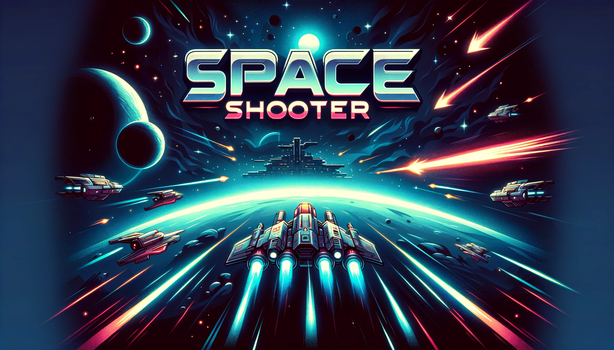

# 🚀 Space Shooter Oyun Geliştirme Projesi



En son projem olan dinamik ve ilgi çekici bir top-down space shooter oyununu sizlerle paylaşmaktan büyük heyecan duyuyorum. Bu proje, oyun geliştirme ve performans optimizasyonu yeteneklerimi sergiliyor.

## 🎮 Oyun Geliştirme

### Oyunun Özeti

Bu proje, oyuncunun uzay gemisi ile düşman gemileri ve asteroidlerle savaşmasını sağlayan bir top-down shooter oyunudur. Oyun, yüksek performans ve akıcı bir oyun deneyimi sunmak için optimize edilmiştir.

### Özellikler

- **Uzay Gemisi Kontrolü**: Oyuncunun uzay gemisini kontrol ederek düşmanları yok etmesi ve asteroidlerden kaçması gerekmektedir.
- **Dinamik Partikül Efektleri**: Mermi ateşleme ve patlama efektleri ile zenginleştirilmiş görseller.
- **Düşman ve Asteroid Yönetimi**: Rastgele pozisyonlarda dinamik olarak oluşturulan düşman gemileri ve asteroidler.

### Görseller


## 🔧 Kullanılan Teknolojiler ve Teknikler

### Yazılım Teknikleri

1. **Unity3D ve C#**:
   - **Unity3D**: Güçlü ve esnek bir oyun motoru olarak kullanıldı.
   - **C#**: Oyun mantığı ve mekanikleri için kullanıldı.

2. **Nesne Yönelimli Programlama (OOP)**:
   - **Soyut Sınıflar ve Kalıtım**: `Character`, `Player` ve `Enemy` sınıfları oluşturuldu. Bu sınıflar, ortak özellikleri ve fonksiyonları merkezi bir yerde toplayarak kod tekrarını azalttı ve bakımı kolaylaştırdı.
   - **Interface Kullanımı**: `IInteractable` ve `IOnHit` interface'leri ile nesnelerin etkileşim ve çarpışma mantıkları esnek hale getirildi.

3. **Performans Optimizasyonu**:
   - **Object Pooling**: Mermiler ve diğer sık kullanılan nesneler için object pooling sistemi kullanıldı. Bu sistem, oyun performansını artırmak için nesnelerin yeniden kullanılmasını sağladı.
   - **Profiler Kullanımı**: Unity Profiler aracı ile performans analizi yaparak, CPU ve GPU kullanımı, bellek yönetimi ve frame rate gibi kritik performans metriklerini optimize ettim.

4. **Oyun Mekanikleri ve Grafikler**:
   - **Partikül Efektleri**: Mermi ateşleme ve patlama efektleri için dinamik partikül sistemleri kullanarak görsel olarak çekici bir oyun deneyimi yarattım.
   - **Düşman ve Asteroid Yönetimi**: Rastgele pozisyonlarda dinamik olarak oluşturulan düşman gemileri ve asteroidlerin kontrolü için scriptler yazdım.

5. **Oyun Olayları ve UI Yönetimi**:
   - **Event Sistemi**: Oyun başladığında, kazanıldığında ve kaybedildiğinde gerekli işlemleri yapacak event sistemi kurdum. Bu sistem, oyun akışını ve kullanıcı etkileşimlerini yönetmek için kullanıldı.
   - **UI Manager**: Oyuncunun sağlık durumu, puanı ve diğer önemli bilgileri göstermek için bir kullanıcı arayüzü yöneticisi geliştirdim.

### 📂 Proje Yapısı

```plaintext
Assets/
├── Scripts/
│   ├── Character.cs
│   ├── Player.cs
│   ├── Enemy.cs
│   ├── Bullet.cs
│   ├── ObjectPooling.cs
│   ├── GameManager.cs
│   └── UIManager.cs
├── Prefabs/
│   ├── Player.prefab
│   ├── Enemy.prefab
│   ├── Bullet.prefab
│   └── Asteroid.prefab
└── Scenes/
    └── MainScene.unity
